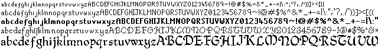

# Old School RuneScape Fonts

[**Download**](https://github.com/runestar/fonts/releases/latest) in OpenType or TrueType

Every font with all characters exactly as appears in-game

| Name | Preview | Size | ID | Client Name | [Cache Name](https://github.com/runestar/cache-names) |
| --- | --- | --- | --- | --- | --- |
| Plain 11 | [link](previews/RuneScape/RuneScape-Plain-11.png) | 16px, 12pt | 494 | PLAIN11 | p11_full |
| Plain 12 | [link](previews/RuneScape/RuneScape-Plain-12.png) | 16px, 12pt | 495 | PLAIN12 | p12_full |
| Bold 12 | [link](previews/RuneScape/RuneScape-Bold-12.png) | 16px, 12pt | 496 | BOLD12 | b12_full |
| Quill 8 | [link](previews/RuneScape/RuneScape-Quill-8.png) | 16px, 12pt | 497 | n/a | q8_full |
| Quill | [link](previews/RuneScape/RuneScape-Quill.png) | 32px, 24pt | 645 | n/a | quill_oblique_large |
| Quill Caps | [link](previews/RuneScape/RuneScape-Quill-Caps.png) | 64px, 48pt | 646 | n/a | quill_caps_large |
| Fairy | [link](previews/RuneScape/RuneScape-Fairy.png) | 32px, 24pt | 647 | n/a | lunar_alphabet |
| Fairy Large | [link](previews/RuneScape/RuneScape-Fairy-Large.png) | 64px, 48pt | 648 | n/a | lunar_alphabet_lrg |
| Barbarian Assault | [link](previews/RuneScape/RuneScape-Barbarian-Assault.png) | 32px, 24pt | 764 | n/a | barbassault_font |
| Surok | [link](previews/RuneScape/RuneScape-Surok.png) | 16px, 12pt | 819 | n/a | surok_font |

| Character | [Byte](https://en.wikipedia.org/wiki/Windows-1252)/Code Point | Name |
| --- | --- | --- |
|   | 20 | SPACE |
| ! | 21 | EXCLAMATION MARK |
| " | 22 | QUOTATION MARK |
| # | 23 | NUMBER SIGN |
| $ | 24 | DOLLAR SIGN |
| % | 25 | PERCENT SIGN |
| & | 26 | AMPERSAND |
| ' | 27 | APOSTROPHE |
| ( | 28 | LEFT PARENTHESIS |
| ) | 29 | RIGHT PARENTHESIS |
| * | 2a | ASTERISK |
| + | 2b | PLUS SIGN |
| , | 2c | COMMA |
| - | 2d | HYPHEN-MINUS |
| . | 2e | FULL STOP |
| / | 2f | SOLIDUS |
| 0 | 30 | DIGIT ZERO |
| 1 | 31 | DIGIT ONE |
| 2 | 32 | DIGIT TWO |
| 3 | 33 | DIGIT THREE |
| 4 | 34 | DIGIT FOUR |
| 5 | 35 | DIGIT FIVE |
| 6 | 36 | DIGIT SIX |
| 7 | 37 | DIGIT SEVEN |
| 8 | 38 | DIGIT EIGHT |
| 9 | 39 | DIGIT NINE |
| : | 3a | COLON |
| ; | 3b | SEMICOLON |
| < | 3c | LESS-THAN SIGN |
| = | 3d | EQUALS SIGN |
| > | 3e | GREATER-THAN SIGN |
| ? | 3f | QUESTION MARK |
| @ | 40 | COMMERCIAL AT |
| A | 41 | LATIN CAPITAL LETTER A |
| B | 42 | LATIN CAPITAL LETTER B |
| C | 43 | LATIN CAPITAL LETTER C |
| D | 44 | LATIN CAPITAL LETTER D |
| E | 45 | LATIN CAPITAL LETTER E |
| F | 46 | LATIN CAPITAL LETTER F |
| G | 47 | LATIN CAPITAL LETTER G |
| H | 48 | LATIN CAPITAL LETTER H |
| I | 49 | LATIN CAPITAL LETTER I |
| J | 4a | LATIN CAPITAL LETTER J |
| K | 4b | LATIN CAPITAL LETTER K |
| L | 4c | LATIN CAPITAL LETTER L |
| M | 4d | LATIN CAPITAL LETTER M |
| N | 4e | LATIN CAPITAL LETTER N |
| O | 4f | LATIN CAPITAL LETTER O |
| P | 50 | LATIN CAPITAL LETTER P |
| Q | 51 | LATIN CAPITAL LETTER Q |
| R | 52 | LATIN CAPITAL LETTER R |
| S | 53 | LATIN CAPITAL LETTER S |
| T | 54 | LATIN CAPITAL LETTER T |
| U | 55 | LATIN CAPITAL LETTER U |
| V | 56 | LATIN CAPITAL LETTER V |
| W | 57 | LATIN CAPITAL LETTER W |
| X | 58 | LATIN CAPITAL LETTER X |
| Y | 59 | LATIN CAPITAL LETTER Y |
| Z | 5a | LATIN CAPITAL LETTER Z |
| [ | 5b | LEFT SQUARE BRACKET |
| \ | 5c | REVERSE SOLIDUS |
| ] | 5d | RIGHT SQUARE BRACKET |
| ^ | 5e | CIRCUMFLEX ACCENT |
| _ | 5f | LOW LINE |
| ` | 60 | GRAVE ACCENT |
| a | 61 | LATIN SMALL LETTER A |
| b | 62 | LATIN SMALL LETTER B |
| c | 63 | LATIN SMALL LETTER C |
| d | 64 | LATIN SMALL LETTER D |
| e | 65 | LATIN SMALL LETTER E |
| f | 66 | LATIN SMALL LETTER F |
| g | 67 | LATIN SMALL LETTER G |
| h | 68 | LATIN SMALL LETTER H |
| i | 69 | LATIN SMALL LETTER I |
| j | 6a | LATIN SMALL LETTER J |
| k | 6b | LATIN SMALL LETTER K |
| l | 6c | LATIN SMALL LETTER L |
| m | 6d | LATIN SMALL LETTER M |
| n | 6e | LATIN SMALL LETTER N |
| o | 6f | LATIN SMALL LETTER O |
| p | 70 | LATIN SMALL LETTER P |
| q | 71 | LATIN SMALL LETTER Q |
| r | 72 | LATIN SMALL LETTER R |
| s | 73 | LATIN SMALL LETTER S |
| t | 74 | LATIN SMALL LETTER T |
| u | 75 | LATIN SMALL LETTER U |
| v | 76 | LATIN SMALL LETTER V |
| w | 77 | LATIN SMALL LETTER W |
| x | 78 | LATIN SMALL LETTER X |
| y | 79 | LATIN SMALL LETTER Y |
| z | 7a | LATIN SMALL LETTER Z |
| { | 7b | LEFT CURLY BRACKET |
| \| | 7c | VERTICAL LINE |
| } | 7d | RIGHT CURLY BRACKET |
| ~ | 7e | TILDE |
| € | 80/20ac | EURO SIGN |
| Π| 8c/152 | LATIN CAPITAL LIGATURE OE |
| — | 97/2014 | EM DASH |
| œ | 9c/153 | LATIN SMALL LIGATURE OE |
| Ÿ | 9f/178 | LATIN CAPITAL LETTER Y WITH DIAERESIS |
|   | a0 | NO-BREAK SPACE |
| ¡ | a1 | INVERTED EXCLAMATION MARK |
| ¢ | a2 | CENT SIGN |
| £ | a3 | POUND SIGN |
| ¤ | a4 | CURRENCY SIGN |
| ¥ | a5 | YEN SIGN |
| ¦ | a6 | BROKEN BAR |
| § | a7 | SECTION SIGN |
| ¨ | a8 | DIAERESIS |
| © | a9 | COPYRIGHT SIGN |
| ª | aa | FEMININE ORDINAL INDICATOR |
| « | ab | LEFT-POINTING DOUBLE ANGLE QUOTATION MARK |
| ¬ | ac | NOT SIGN |
| ­ | ad | SOFT HYPHEN |
| ® | ae | REGISTERED SIGN |
| ¯ | af | MACRON |
| ° | b0 | DEGREE SIGN |
| ± | b1 | PLUS-MINUS SIGN |
| ² | b2 | SUPERSCRIPT TWO |
| ³ | b3 | SUPERSCRIPT THREE |
| ´ | b4 | ACUTE ACCENT |
| µ | b5 | MICRO SIGN |
| ¶ | b6 | PILCROW SIGN |
| · | b7 | MIDDLE DOT |
| ¸ | b8 | CEDILLA |
| ¹ | b9 | SUPERSCRIPT ONE |
| º | ba | MASCULINE ORDINAL INDICATOR |
| » | bb | RIGHT-POINTING DOUBLE ANGLE QUOTATION MARK |
| ¼ | bc | VULGAR FRACTION ONE QUARTER |
| ½ | bd | VULGAR FRACTION ONE HALF |
| ¾ | be | VULGAR FRACTION THREE QUARTERS |
| ¿ | bf | INVERTED QUESTION MARK |
| À | c0 | LATIN CAPITAL LETTER A WITH GRAVE |
| Á | c1 | LATIN CAPITAL LETTER A WITH ACUTE |
| Â | c2 | LATIN CAPITAL LETTER A WITH CIRCUMFLEX |
| Ã | c3 | LATIN CAPITAL LETTER A WITH TILDE |
| Ä | c4 | LATIN CAPITAL LETTER A WITH DIAERESIS |
| Å | c5 | LATIN CAPITAL LETTER A WITH RING ABOVE |
| Æ | c6 | LATIN CAPITAL LETTER AE |
| Ç | c7 | LATIN CAPITAL LETTER C WITH CEDILLA |
| È | c8 | LATIN CAPITAL LETTER E WITH GRAVE |
| É | c9 | LATIN CAPITAL LETTER E WITH ACUTE |
| Ê | ca | LATIN CAPITAL LETTER E WITH CIRCUMFLEX |
| Ë | cb | LATIN CAPITAL LETTER E WITH DIAERESIS |
| Ì | cc | LATIN CAPITAL LETTER I WITH GRAVE |
| Í | cd | LATIN CAPITAL LETTER I WITH ACUTE |
| Î | ce | LATIN CAPITAL LETTER I WITH CIRCUMFLEX |
| Ï | cf | LATIN CAPITAL LETTER I WITH DIAERESIS |
| Ð | d0 | LATIN CAPITAL LETTER ETH |
| Ñ | d1 | LATIN CAPITAL LETTER N WITH TILDE |
| Ò | d2 | LATIN CAPITAL LETTER O WITH GRAVE |
| Ó | d3 | LATIN CAPITAL LETTER O WITH ACUTE |
| Ô | d4 | LATIN CAPITAL LETTER O WITH CIRCUMFLEX |
| Õ | d5 | LATIN CAPITAL LETTER O WITH TILDE |
| Ö | d6 | LATIN CAPITAL LETTER O WITH DIAERESIS |
| × | d7 | MULTIPLICATION SIGN |
| Ø | d8 | LATIN CAPITAL LETTER O WITH STROKE |
| Ù | d9 | LATIN CAPITAL LETTER U WITH GRAVE |
| Ú | da | LATIN CAPITAL LETTER U WITH ACUTE |
| Û | db | LATIN CAPITAL LETTER U WITH CIRCUMFLEX |
| Ü | dc | LATIN CAPITAL LETTER U WITH DIAERESIS |
| Ý | dd | LATIN CAPITAL LETTER Y WITH ACUTE |
| Þ | de | LATIN CAPITAL LETTER THORN |
| ß | df | LATIN SMALL LETTER SHARP S |
| à | e0 | LATIN SMALL LETTER A WITH GRAVE |
| á | e1 | LATIN SMALL LETTER A WITH ACUTE |
| â | e2 | LATIN SMALL LETTER A WITH CIRCUMFLEX |
| ã | e3 | LATIN SMALL LETTER A WITH TILDE |
| ä | e4 | LATIN SMALL LETTER A WITH DIAERESIS |
| å | e5 | LATIN SMALL LETTER A WITH RING ABOVE |
| æ | e6 | LATIN SMALL LETTER AE |
| ç | e7 | LATIN SMALL LETTER C WITH CEDILLA |
| è | e8 | LATIN SMALL LETTER E WITH GRAVE |
| é | e9 | LATIN SMALL LETTER E WITH ACUTE |
| ê | ea | LATIN SMALL LETTER E WITH CIRCUMFLEX |
| ë | eb | LATIN SMALL LETTER E WITH DIAERESIS |
| ì | ec | LATIN SMALL LETTER I WITH GRAVE |
| í | ed | LATIN SMALL LETTER I WITH ACUTE |
| î | ee | LATIN SMALL LETTER I WITH CIRCUMFLEX |
| ï | ef | LATIN SMALL LETTER I WITH DIAERESIS |
| ð | f0 | LATIN SMALL LETTER ETH |
| ñ | f1 | LATIN SMALL LETTER N WITH TILDE |
| ò | f2 | LATIN SMALL LETTER O WITH GRAVE |
| ó | f3 | LATIN SMALL LETTER O WITH ACUTE |
| ô | f4 | LATIN SMALL LETTER O WITH CIRCUMFLEX |
| õ | f5 | LATIN SMALL LETTER O WITH TILDE |
| ö | f6 | LATIN SMALL LETTER O WITH DIAERESIS |
| ÷ | f7 | DIVISION SIGN |
| ø | f8 | LATIN SMALL LETTER O WITH STROKE |
| ù | f9 | LATIN SMALL LETTER U WITH GRAVE |
| ú | fa | LATIN SMALL LETTER U WITH ACUTE |
| û | fb | LATIN SMALL LETTER U WITH CIRCUMFLEX |
| ü | fc | LATIN SMALL LETTER U WITH DIAERESIS |
| ý | fd | LATIN SMALL LETTER Y WITH ACUTE |
| þ | fe | LATIN SMALL LETTER THORN |
| ÿ | ff | LATIN SMALL LETTER Y WITH DIAERESIS |
