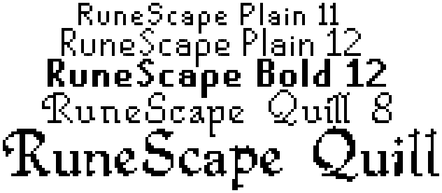

# Old School RuneScape Fonts

All 10 fonts with all 192 characters exactly as appears in-game

[**Download**](https://github.com/RuneStar/fonts/releases) in the following formats. Use `ttf` if unsure.

| name | extension | format | type |
| --- | --- | --- | --- |
| ttf | .ttf | TrueType | outlines |
| otf | .otf | OpenType | outlines  |
| otf-1k | .otf | OpenType | outlines; 1000 em size |
| svg | .svg | Scalable Vector Graphics | outlines |
| fon | .fon | Windows FON | bitmap |
| bdf | .bdf | Glyph Bitmap Distribution | bitmap |
| dfont | .dfont | Mac OS X Data Fork Suitcase | bitmap |

For exact rendering use the below sizes and disable anti-aliasing

| Name | pt | px |
| --- | --- | --- |
| Plain 11 | 12 | 16 |
| Plain 12 | 12 | 16 |
| Bold 12 | 12 | 16 |
| Quill 8 | 24 | 32 |
| Quill | 24 | 32 |

Source of font names:

| Name | ID | Client Name | [Cache Name](https://github.com/RuneStar/cache-names) |
| --- | --- | --- | --- |
| Plain 11 | 494 | PLAIN11 | p11_full |
| Plain 12 | 495 | PLAIN12 | p12_full |
| Bold 12 | 496 | BOLD12 | b12_full |
| Quill 8 | 497 | n/a | q8_full |
| Quill | 645 | n/a | ? |
| Quill Caps Large | 646 | n/a | quill_caps_large |
| Fairy | 647 | n/a | lunar_alphabet |
| Fairy Large | 648 | n/a | lunar_alphabet_lrg |
| Barbarian Assault | 764 | n/a | barbassault_font |
| Surok | 819 | n/a | surok_font |

Supported characters:

| Character | Code Point | Name |
| --- | --- | --- |
|   | 32 | SPACE |
| ! | 33 | EXCLAMATION MARK |
| " | 34 | QUOTATION MARK |
| # | 35 | NUMBER SIGN |
| $ | 36 | DOLLAR SIGN |
| % | 37 | PERCENT SIGN |
| & | 38 | AMPERSAND |
| ' | 39 | APOSTROPHE |
| ( | 40 | LEFT PARENTHESIS |
| ) | 41 | RIGHT PARENTHESIS |
| * | 42 | ASTERISK |
| + | 43 | PLUS SIGN |
| , | 44 | COMMA |
| - | 45 | HYPHEN-MINUS |
| . | 46 | FULL STOP |
| / | 47 | SOLIDUS |
| 0 | 48 | DIGIT ZERO |
| 1 | 49 | DIGIT ONE |
| 2 | 50 | DIGIT TWO |
| 3 | 51 | DIGIT THREE |
| 4 | 52 | DIGIT FOUR |
| 5 | 53 | DIGIT FIVE |
| 6 | 54 | DIGIT SIX |
| 7 | 55 | DIGIT SEVEN |
| 8 | 56 | DIGIT EIGHT |
| 9 | 57 | DIGIT NINE |
| : | 58 | COLON |
| ; | 59 | SEMICOLON |
| < | 60 | LESS-THAN SIGN |
| = | 61 | EQUALS SIGN |
| > | 62 | GREATER-THAN SIGN |
| ? | 63 | QUESTION MARK |
| @ | 64 | COMMERCIAL AT |
| A | 65 | LATIN CAPITAL LETTER A |
| B | 66 | LATIN CAPITAL LETTER B |
| C | 67 | LATIN CAPITAL LETTER C |
| D | 68 | LATIN CAPITAL LETTER D |
| E | 69 | LATIN CAPITAL LETTER E |
| F | 70 | LATIN CAPITAL LETTER F |
| G | 71 | LATIN CAPITAL LETTER G |
| H | 72 | LATIN CAPITAL LETTER H |
| I | 73 | LATIN CAPITAL LETTER I |
| J | 74 | LATIN CAPITAL LETTER J |
| K | 75 | LATIN CAPITAL LETTER K |
| L | 76 | LATIN CAPITAL LETTER L |
| M | 77 | LATIN CAPITAL LETTER M |
| N | 78 | LATIN CAPITAL LETTER N |
| O | 79 | LATIN CAPITAL LETTER O |
| P | 80 | LATIN CAPITAL LETTER P |
| Q | 81 | LATIN CAPITAL LETTER Q |
| R | 82 | LATIN CAPITAL LETTER R |
| S | 83 | LATIN CAPITAL LETTER S |
| T | 84 | LATIN CAPITAL LETTER T |
| U | 85 | LATIN CAPITAL LETTER U |
| V | 86 | LATIN CAPITAL LETTER V |
| W | 87 | LATIN CAPITAL LETTER W |
| X | 88 | LATIN CAPITAL LETTER X |
| Y | 89 | LATIN CAPITAL LETTER Y |
| Z | 90 | LATIN CAPITAL LETTER Z |
| [ | 91 | LEFT SQUARE BRACKET |
| \ | 92 | REVERSE SOLIDUS |
| ] | 93 | RIGHT SQUARE BRACKET |
| ^ | 94 | CIRCUMFLEX ACCENT |
| _ | 95 | LOW LINE |
| ` | 96 | GRAVE ACCENT |
| a | 97 | LATIN SMALL LETTER A |
| b | 98 | LATIN SMALL LETTER B |
| c | 99 | LATIN SMALL LETTER C |
| d | 100 | LATIN SMALL LETTER D |
| e | 101 | LATIN SMALL LETTER E |
| f | 102 | LATIN SMALL LETTER F |
| g | 103 | LATIN SMALL LETTER G |
| h | 104 | LATIN SMALL LETTER H |
| i | 105 | LATIN SMALL LETTER I |
| j | 106 | LATIN SMALL LETTER J |
| k | 107 | LATIN SMALL LETTER K |
| l | 108 | LATIN SMALL LETTER L |
| m | 109 | LATIN SMALL LETTER M |
| n | 110 | LATIN SMALL LETTER N |
| o | 111 | LATIN SMALL LETTER O |
| p | 112 | LATIN SMALL LETTER P |
| q | 113 | LATIN SMALL LETTER Q |
| r | 114 | LATIN SMALL LETTER R |
| s | 115 | LATIN SMALL LETTER S |
| t | 116 | LATIN SMALL LETTER T |
| u | 117 | LATIN SMALL LETTER U |
| v | 118 | LATIN SMALL LETTER V |
| w | 119 | LATIN SMALL LETTER W |
| x | 120 | LATIN SMALL LETTER X |
| y | 121 | LATIN SMALL LETTER Y |
| z | 122 | LATIN SMALL LETTER Z |
| { | 123 | LEFT CURLY BRACKET |
| \| | 124 | VERTICAL LINE |
| } | 125 | RIGHT CURLY BRACKET |
| ~ | 126 | TILDE |
|   | 160 | NO-BREAK SPACE |
| ¡ | 161 | INVERTED EXCLAMATION MARK |
| ¢ | 162 | CENT SIGN |
| £ | 163 | POUND SIGN |
| ¤ | 164 | CURRENCY SIGN |
| ¥ | 165 | YEN SIGN |
| ¦ | 166 | BROKEN BAR |
| § | 167 | SECTION SIGN |
| ¨ | 168 | DIAERESIS |
| © | 169 | COPYRIGHT SIGN |
| ª | 170 | FEMININE ORDINAL INDICATOR |
| « | 171 | LEFT-POINTING DOUBLE ANGLE QUOTATION MARK |
| ¬ | 172 | NOT SIGN |
| ­ | 173 | SOFT HYPHEN |
| ® | 174 | REGISTERED SIGN |
| ¯ | 175 | MACRON |
| ° | 176 | DEGREE SIGN |
| ± | 177 | PLUS-MINUS SIGN |
| ² | 178 | SUPERSCRIPT TWO |
| ³ | 179 | SUPERSCRIPT THREE |
| ´ | 180 | ACUTE ACCENT |
| µ | 181 | MICRO SIGN |
| ¶ | 182 | PILCROW SIGN |
| · | 183 | MIDDLE DOT |
| ¸ | 184 | CEDILLA |
| ¹ | 185 | SUPERSCRIPT ONE |
| º | 186 | MASCULINE ORDINAL INDICATOR |
| » | 187 | RIGHT-POINTING DOUBLE ANGLE QUOTATION MARK |
| ¼ | 188 | VULGAR FRACTION ONE QUARTER |
| ½ | 189 | VULGAR FRACTION ONE HALF |
| ¾ | 190 | VULGAR FRACTION THREE QUARTERS |
| ¿ | 191 | INVERTED QUESTION MARK |
| À | 192 | LATIN CAPITAL LETTER A WITH GRAVE |
| Á | 193 | LATIN CAPITAL LETTER A WITH ACUTE |
| Â | 194 | LATIN CAPITAL LETTER A WITH CIRCUMFLEX |
| Ã | 195 | LATIN CAPITAL LETTER A WITH TILDE |
| Ä | 196 | LATIN CAPITAL LETTER A WITH DIAERESIS |
| Å | 197 | LATIN CAPITAL LETTER A WITH RING ABOVE |
| Æ | 198 | LATIN CAPITAL LETTER AE |
| Ç | 199 | LATIN CAPITAL LETTER C WITH CEDILLA |
| È | 200 | LATIN CAPITAL LETTER E WITH GRAVE |
| É | 201 | LATIN CAPITAL LETTER E WITH ACUTE |
| Ê | 202 | LATIN CAPITAL LETTER E WITH CIRCUMFLEX |
| Ë | 203 | LATIN CAPITAL LETTER E WITH DIAERESIS |
| Ì | 204 | LATIN CAPITAL LETTER I WITH GRAVE |
| Í | 205 | LATIN CAPITAL LETTER I WITH ACUTE |
| Î | 206 | LATIN CAPITAL LETTER I WITH CIRCUMFLEX |
| Ï | 207 | LATIN CAPITAL LETTER I WITH DIAERESIS |
| Ð | 208 | LATIN CAPITAL LETTER ETH |
| Ñ | 209 | LATIN CAPITAL LETTER N WITH TILDE |
| Ò | 210 | LATIN CAPITAL LETTER O WITH GRAVE |
| Ó | 211 | LATIN CAPITAL LETTER O WITH ACUTE |
| Ô | 212 | LATIN CAPITAL LETTER O WITH CIRCUMFLEX |
| Õ | 213 | LATIN CAPITAL LETTER O WITH TILDE |
| Ö | 214 | LATIN CAPITAL LETTER O WITH DIAERESIS |
| × | 215 | MULTIPLICATION SIGN |
| Ø | 216 | LATIN CAPITAL LETTER O WITH STROKE |
| Ù | 217 | LATIN CAPITAL LETTER U WITH GRAVE |
| Ú | 218 | LATIN CAPITAL LETTER U WITH ACUTE |
| Û | 219 | LATIN CAPITAL LETTER U WITH CIRCUMFLEX |
| Ü | 220 | LATIN CAPITAL LETTER U WITH DIAERESIS |
| Ý | 221 | LATIN CAPITAL LETTER Y WITH ACUTE |
| Þ | 222 | LATIN CAPITAL LETTER THORN |
| ß | 223 | LATIN SMALL LETTER SHARP S |
| à | 224 | LATIN SMALL LETTER A WITH GRAVE |
| á | 225 | LATIN SMALL LETTER A WITH ACUTE |
| â | 226 | LATIN SMALL LETTER A WITH CIRCUMFLEX |
| ã | 227 | LATIN SMALL LETTER A WITH TILDE |
| ä | 228 | LATIN SMALL LETTER A WITH DIAERESIS |
| å | 229 | LATIN SMALL LETTER A WITH RING ABOVE |
| æ | 230 | LATIN SMALL LETTER AE |
| ç | 231 | LATIN SMALL LETTER C WITH CEDILLA |
| è | 232 | LATIN SMALL LETTER E WITH GRAVE |
| é | 233 | LATIN SMALL LETTER E WITH ACUTE |
| ê | 234 | LATIN SMALL LETTER E WITH CIRCUMFLEX |
| ë | 235 | LATIN SMALL LETTER E WITH DIAERESIS |
| ì | 236 | LATIN SMALL LETTER I WITH GRAVE |
| í | 237 | LATIN SMALL LETTER I WITH ACUTE |
| î | 238 | LATIN SMALL LETTER I WITH CIRCUMFLEX |
| ï | 239 | LATIN SMALL LETTER I WITH DIAERESIS |
| ð | 240 | LATIN SMALL LETTER ETH |
| ñ | 241 | LATIN SMALL LETTER N WITH TILDE |
| ò | 242 | LATIN SMALL LETTER O WITH GRAVE |
| ó | 243 | LATIN SMALL LETTER O WITH ACUTE |
| ô | 244 | LATIN SMALL LETTER O WITH CIRCUMFLEX |
| õ | 245 | LATIN SMALL LETTER O WITH TILDE |
| ö | 246 | LATIN SMALL LETTER O WITH DIAERESIS |
| ÷ | 247 | DIVISION SIGN |
| ø | 248 | LATIN SMALL LETTER O WITH STROKE |
| ù | 249 | LATIN SMALL LETTER U WITH GRAVE |
| ú | 250 | LATIN SMALL LETTER U WITH ACUTE |
| û | 251 | LATIN SMALL LETTER U WITH CIRCUMFLEX |
| ü | 252 | LATIN SMALL LETTER U WITH DIAERESIS |
| ý | 253 | LATIN SMALL LETTER Y WITH ACUTE |
| þ | 254 | LATIN SMALL LETTER THORN |
| ÿ | 255 | LATIN SMALL LETTER Y WITH DIAERESIS |
| € | 8364 | EURO SIGN |
